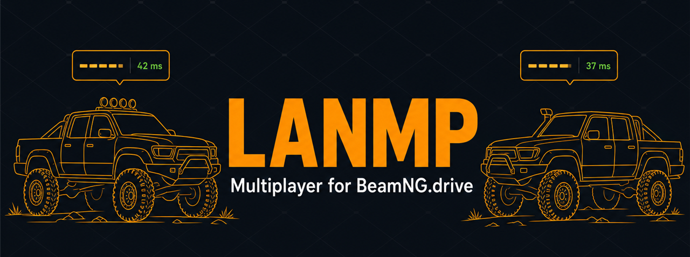
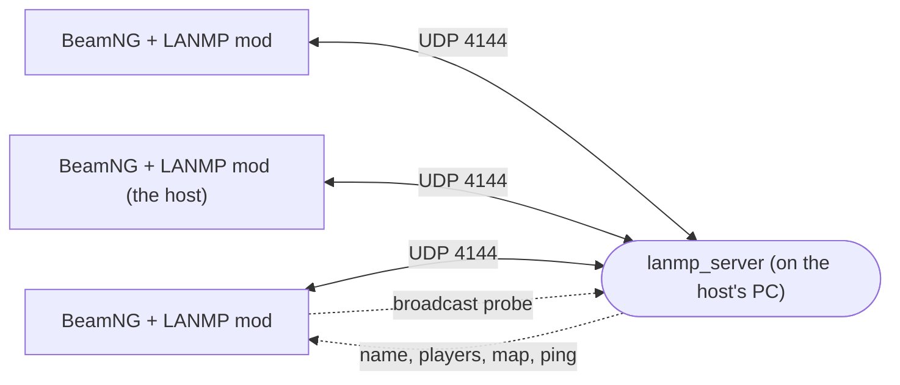

<div align="center">



Drive together on your LAN or over the internet.

Synced vehicles · nametags with live ping · player list · chat · a server browser that finds
games on your network by itself.

[](tests/test_protocol.py)
[](server/)
[](mod/)
[](#status)

</div>

---

One person runs a small C++ server on their own PC, everyone else installs the mod and joins.
No launcher, no Python, no bridge process during gameplay — the mod speaks UDP straight from
BeamNG through LuaSocket.



## Download

| File | Who needs it |
| --- | --- |
| [`LANMP.zip`](../../releases/latest) | every player — the BeamNG mod |
| [`LANMP-Server.zip`](../../releases/latest) | the host — server executable + launcher |

Both are attached to the [latest release](../../releases/latest), or build them yourself
(see [Building](#building)).

## Quick start

**If you are hosting**

1. Grab `LANMP-Server.zip` (or build it — see [Building](#building)) and unzip it anywhere.
2. Double-click **Launch Online Multiplayer Server Host.bat**. Leave the window open.
   It opens UDP 4144 in the firewall if it can, and prints the addresses friends can type in.
3. Install the mod too, then join your own server like everyone else.

**If you are joining**

1. Drop `LANMP.zip` into `%LOCALAPPDATA%\BeamNG.drive\<version>\mods\`.
2. Start BeamNG, load the same map as the server, open the **LANMP** app
   (Escape → UI Apps → drag LANMP onto the screen).
3. Press **Refresh** — servers on your network appear with name, players, map and real ping.
   Click one, or type the host's IP if you are not on the same network.
4. First time: pick a username and press **New account**; the server hands back a PIN.
   That PIN is your password from then on.

## Features

| | |
| --- | --- |
| **Server browser** | Broadcast discovery on ports 4144-4147, replies matched by nonce so the listed ping is a real round trip. Manual IP entry always available. |
| **Vehicle sync** | Position, orientation, linear + angular velocity and acceleration, sequenced and dead-reckoned. Corrections are applied as cluster forces in vehicle Lua, not teleports. |
| **Multiple vehicles** | Each player may own several cars; spawn, reset and despawn all replicate. |
| **Nametags** | Name, live ping and distance above every remote car, faded with distance, toggleable. |
| **Player list + chat** | In the LANMP app, with per-player ping updated once a second. |
| **Accounts** | Username + PIN, salted iterative hashing, open or closed registration. |
| **Hardened** | Every gameplay packet carries a session key — the source address is never trusted. Bounds-checked parsing, rate-limited auth and chat, stale-packet rejection, NAT rebinding support. |

## Status

**Verified here:** the server builds clean and passes an 18-case UDP integration suite driven by
fake clients over a real socket — handshake, register/login, bad credentials, auth rate limiting,
join/leave, roster + ping, vehicle spawn/despawn, position sequencing, input relay, chat
throttling, late-joiner world state, malformed packets, LAN discovery replies and discovery
throttling. All Lua, JS and JSON is syntax-checked.

**Not verified:** anything inside BeamNG.drive. The game is not installed on the machine this was
written on, so the server browser UI, nametag rendering and the physics correction tuning are
code-complete but unproven against a live engine. Expect to iterate on the first real session —
open the console with `Ctrl+~` and file what you see.

## Building

```bash
cd server
cmake -S . -B build -G "MinGW Makefiles"   # MSVC works too
cmake --build build --config Release

python ../tools/pack_mod.py     # -> dist/LANMP.zip        (players)
python ../tools/pack_host.py    # -> dist/LANMP-Server.zip (host)
```

Running the server by hand:

```bash
build/lanmp_server --name "My Server" --max-players 8
```

| flag | default | meaning |
| --- | --- | --- |
| `--port <n>` | 4144 | UDP port |
| `--users <file>` | users.txt | account database |
| `--name <text>` | LANMP Server | shown in the server browser |
| `--map <path>` | /levels/gridmap_v2/info.json | map everyone should load |
| `--max-players <n>` | 8 | player cap |
| `--tick <n>` | 30 | broadcast tick rate |
| `--closed` | off | disable open registration |
| `--verbose` | off | debug logging |

## Playing over the internet

Broadcast discovery does not cross subnets, so remote players type the host's address in.
Forward **UDP 4144** to the host machine and hand out the public IP, or put everyone on a VPN
(Radmin / Hamachi / Tailscale) — a VPN carries broadcast, so the server even shows up in the
browser. Clients are identified by session key rather than address, so NAT rebinding mid-session
is handled.

## Layout

```
server/    C++17 UDP server (standard library + ws2_32, nothing else)
mod/       the BeamNG mod: GE extensions, vehicle extensions, UI app
tests/     headless fake-client protocol suite
tools/     packaging scripts + the host launcher bundle
```

## How it works

* **Transport** — `mod/lua/ge/extensions/lanmp/network.lua` opens a nonblocking LuaSocket UDP
  socket and drains up to 256 datagrams per frame, so a dead server never stalls the game.
* **Discovery** — `discovery.lua` broadcasts a tiny probe from its own socket; servers answer with
  name, player count, map and version, throttled per source address so they are a poor
  amplification target.
* **Vehicle sync** — the owner samples state and stamps it with a sequence number; remote copies
  live in `lanmpSyncVE` and are dead-reckoned forward and force-corrected, with teleporting kept
  as a last resort for severe divergence. Steering/throttle/brake/gear relay at 15 Hz.
* **Nametags** — engine debug text, distance-faded, live ping from the roster.

## Security notes

The threat model is "people you invited". PINs travel over plain UDP, so do not reuse a password
you care about, and do not expose the port to the open internet without a VPN. Hashing is salted
iterative SHA-256 — adequate here, but not a modern password KDF. Discovery replies are
unauthenticated by nature; they leak only the server name, map and player count.

## Tests

```bash
cd server && cmake --build build
python tests/test_protocol.py
```

The suite starts the real server binary and speaks the real wire protocol over UDP — it is
testing the format the Lua mod has to match, not a mock of it.
